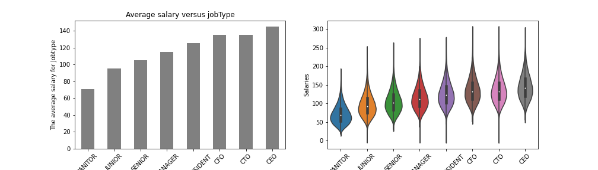
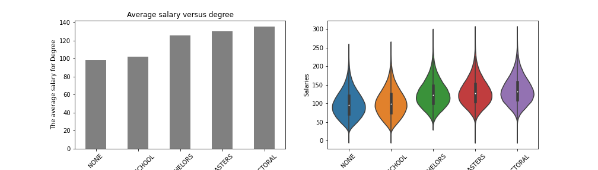
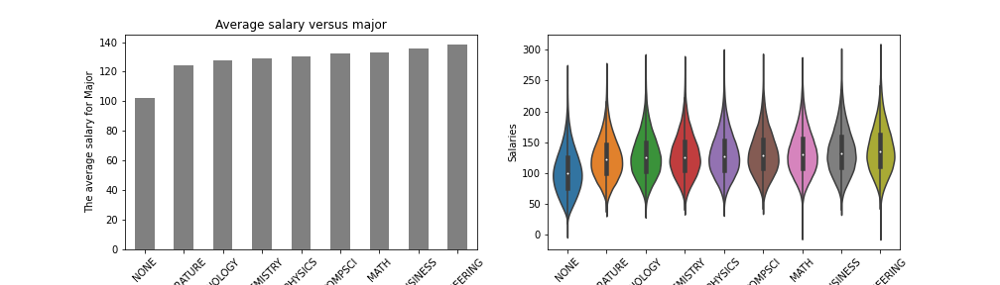
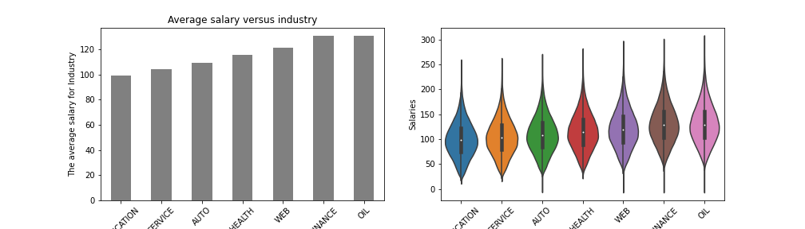
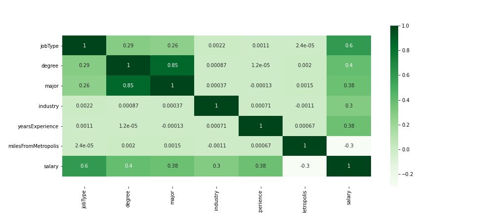
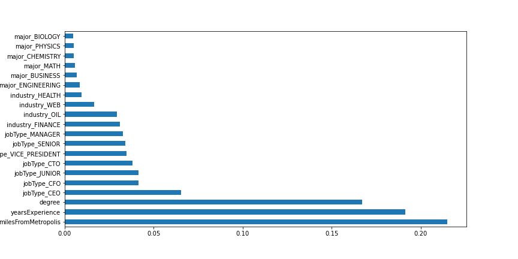

# Salary Prediction Portfolio
## Problem Definition:
The purpose of this project is to predict the salary based on various factors like jobtype, degree, subject major in terms of education, type of industry, years of experience and miles from metropolis.

## Purpose:
 - Can be used by organization to set tha salary range for employees and a reference point while creating new job posting.
 - Can be used by the government to analyse the trends in job market/economy growth and salary range to the corresponding related jobs.
 - Can be a reference for any individual who is in the job to verify for validation or for applying new jobs.

## Datasets:
**train_features.csv:** Each row represents an observation for each individual job posting. The "jobId" column is unique to each job posting and the other columns are the different features of the job postings. The file has eight(8) columns.

**train-salaries.csv:** Each row is a unique job posting with its corresponding salary. The file contains two (2) columns. The file is combined with train_features.csv to train the machine learning models.

**test_features.csv:** Similar to train_features.csv, each row in this file is metadata for each individual job posting. The file has eight (8) columns and is used to predict the new salaries.

## Features Description:

JobId: Primary Key - unique identifier for each job posting

companyId: Foreign Key - unique identifier for each company corresponding to the job posting

jobType: Job level (e.g janitor, manager, CEO)

degree: Educational level (e.g Bachelor, Doctoral)

major: Subject major in education (e.g. Businesss, Literature, engineering)

industry: field or industry of the job posting (e.g engnieering, oil, finance)

yearsExperience: years of experience in that job(industry/domain)

milesFromMetropolis: distance away from the metropolis, in miles(mi)

salary: salary paid for the job, in thousands US dollars; target variable

## Data Preprocessing:

**Cleaning and Explanatory Data Analysis**

Checked for null values

Checked for duplicate values

Check for outliers Deleted the rows with salary < 0. Calculated the quantile value for 75% and 25%, the value above 75% - 220,000 are tend to be outliers. Verfied and validated the data as those rows are legidimate and those salary belongs to c-type jobs or from highly paid industry like oil, finance or web.

The target variable salary is normally distributed with right skewness, which is due to outliers and verified.

Performed explanatory data analysis to learn more about the relation between each feature and the target variable,

______________________
#### Salary versus jobType
____________________

The c-type job like CEO, CTO, CFO have higher average salary and the order goes down.

_________________
#### Salary versus degree
_________________________

The higher the degree level the higher the salary is, eg Doctoral have higher salary though it all depends on field, industry and jobType, the visualization just implies how 
educational level infuence the salary.

__________________
#### Salary versus major
_______________________

Technical major have higher average salary

__________________________________
#### Salary versus industry
______________________

Oil, web and finance industry seems to have higher salary

## Feature Engineering:

Performed one-hot encoding for nominal categorical variable like jobType, major and industry and performed label encoding for degree, used the educational level for labeling eventhough it is not a typical ordinal variable.

### Checked for correlation:

Most of the features are positively correlated with the target variable salary and there is no evidence of muticollinearlity of correlation > 0.9, whereas milesFromMetropolis is negatively correlated with Salary.

## Regression Models:

__Created base line model with mean squared error - 963.__

Used three models to train the model,

 * Linear Regression
 * Random Forest
 * XGBoost

Trained the model with manual parameter and same model with k-fold(k=5) cross validation

  | Model   | Linear Regression  | Random Forest  | XGBoost  |
  | ----  | -------- | ---------- | ---------- |
  | No CV   |     383.46         |     366.56     |  358.51  |
  | with CV |     383.52         |     378.19     |  367.31  |
     

From the above table, it shows XGBoost seems have lower mean squared error with and without cross validation compared to the other two models(Linear regression and Random Forest), so performed hyperparameter tunning for XGBoost.

## Hyperparameter Tunning:

The mean squared error of hyperparameter tunned model is,

|   Mean Squred Error   | XGBoost |
| -------- | -------- |
| Hyperparameter tunned | 354.79  |

## Predicted Result:

The salary is predicted after learning the data from the trained dataset. Predicted result is save under **predictedsalary_out.csv**

|  | jobId | prediction |
|---|----- | ------- |
| 0 |	JOB1362685407687 |	138.182236 |
| 1	| JOB1362685407688 |	116.894569 |
| 2 |	JOB1362685407689	| 135.585800 |
| 3	| JOB1362685407690 |	117.391464 |
| 4	| JOB1362685407691 |	134.771408 |

## Deployment:

Created and loaded a pickel file for deployment, which will be the next step.

## Feature importance:

Below is the feature importance for feature selection for further tunning the model.

